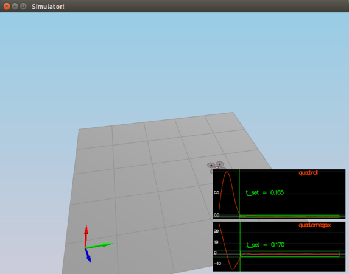
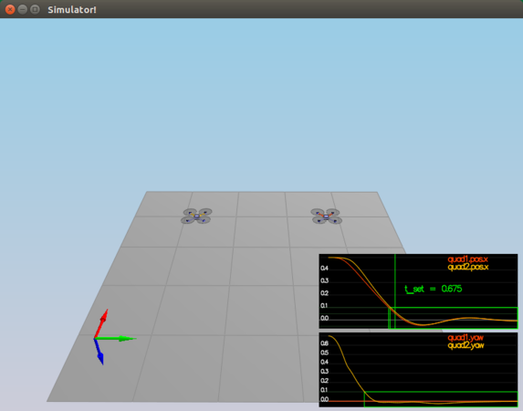
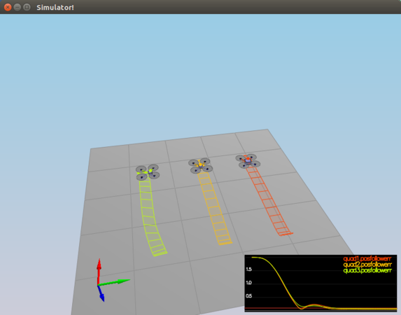
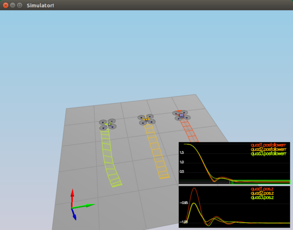
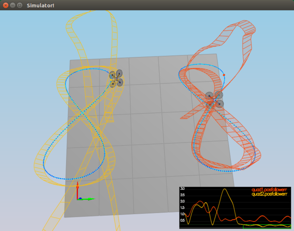
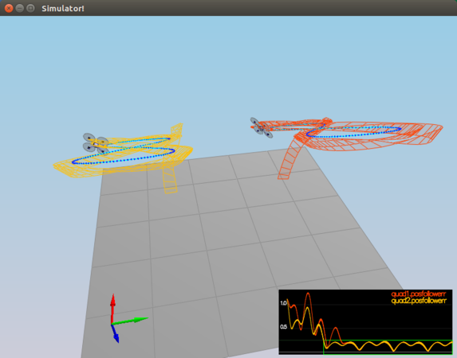

# Project: Control of a 3D Quadrotor
### Vic Sperry, Udacity Flying Car Nanodegree, 01 Nov 2018

## [Rubric](https://review.udacity.com/#!/rubrics/1643/view) Items
### 1. Writeup
This is the writeup.

[//]: # "Note to self: C-c C-c e"

### 2. Implement body rate control in C++
The GenerateMotorCommands() function involved using simple equations relating force to moments. It's really about getting the orientation of the vehicle correct. For example, what is a positive roll? We talked about that at the beginning of the class. As you look "down" on the body-frame X-axis (i.e. pretend the positive X-axis is poking you in the eye), orient your right hand's thumb along that axis (go ahead and poke your eye out if you want), curl your fingers into your palm, and that's a positive roll moment. Looking from the rear of the airframe, sighting along the X-axis, that's a clockwise rotation. So to make that happen, the speed of the two fans on the left must be increased relative to the two fans on the right. It's a similar story for pitch. Yaw, however, is different. On a quad-copter, yaw is produced by the reactive torque of the motors. That's why we have two fans spinning clockwise and two spinning anti-clockwise -- so that they can be tweaked to balance each other out. For yaw, the equations involve adding up the positive and negative torques to get a net torque. Being able to yaw the vehicle is a function of how much torque is produced as fan speed is increased, which is a function of the motor characteristics. This is captured in variable "kappa". I found that I had very little yaw authority with the default value of kappa. With even low values of yaw torque demand, the equations produced negative thrust on two of the propellers. I also got negative thrust demands for pitch and roll if I turned up the torque demands too high. So I limited the output forces using minMotorThrust and maxMotorThrust. As far as coding this function, it was about setting up the equations correctly, then doing some algebra to solve a system of four equations and four unknowns, which I found to be tedious and error-prone, and I did it wrong twice. 😠

The next part of this task was to write BodyRateControl(), which takes a commanded and actual set of PQR values and produces a set of three torques, or moments. PQR are angular velocities in the body frame for roll, pitch, and yaw, respectively, as would be read from a strap-down IMU. The output torques are those that will drive the attitude to reduce the error in commanded vs actual to zero. The code for this function is just a P controller, creating an output that is proportional to the difference between the commanded and actual rates. It is tuned with the three kpPQR values. Untuned, the quadcopter rolls over a number of times until it crashes. By turning up the P gain for roll, I got the omega.x value (rotational velocity of the vehicle about roll) to drive to zero, but by the time it stops rotating, the quadcopter is rolled to some angle relative to the ground, so the copter flies off to the right in the simulator. To fix that, we need to do the next item.

### 3. Implement roll pitch control in C++
In RollPitchControl() we are producing the angular velocity demands in the body frame, PQR. P is desired roll rate, Q is desired pitch rate, and R is desired yaw rate. Since yaw is handled separately, we set it to zero here. Inputs are a desired acceleration in the world frame, a quaternion describing the current attitude of the vehicle (i.e. how to rotate a vector in the world frame into the body frame and vice-versa), and the desired collective thrust to be produced by all fans working together.

The equations implemented for P\_demand and Q\_demand are derived from equations in http://www.dynsyslab.org/wp-content/papercite-data/pdf/schoellig-acc12.pdf. See equations (2) and (6), and the paragraph above equation (6). I have more details in the code comments.

This was one of the most interesting functions to implement, and also one of the most frustrating. My first approach was to simply port the code in the given solution in python, roll\_pitch\_controller in controller.py. I tuned it and got it working (see below). But I didn't understand the calculation of P\_demand and Q\_demand, so I went back to the referenced paper and worked through the equations again. I just couldn't figure out why the target\_R13 and target\_R23 values had had their signs reversed, and why the terms within the equations for P\_demand and Q\_demand had had their signs reversed as compared to the paper. I re-implemented the function, closely following the paper, and nothing worked at all until I tried using the _other_ rotation matrix in the quaternion class, i.e. 

<pre>
Mat3x3F R = attitude.RotationMatrix_BwrtI();
</pre>

That fixed everything. Equations look just like in the paper, all signs match, and everything started working again. I think somebody misinterpreted which rotation matrix was needed or the quaternion class is implemented incorrectly. Funny thing about this is that it means that the python code euler2RM() is also implemented incorrectly. Hmm...

I spent a lot of time tuning kpPQR.P and kpBank. I couldn't get the t\_set times down as far as shown in the README gif, but I did the best I could. Here is a table of my experimentation.
<pre>
                      t_set
kpBank kpPQR.P quad.roll quad.omega.x
19     10000   0.190     0.200
16     5000    0.200     0.160
13     4500    0.185     0.165
12     4000    0.190     0.170
11     3750    0.170     0.170
11     3700    0.165     0.170
11     3670    0.165     0.170
11     3650    0.165     0.170    <- picked this one
11     3600    0.165     0.170
11     3500    0.165     0.175
11     3400    0.200     0.175
10     3000    0.180     0.180
9      2500    0.205     0.190
8      2000    0.250     0.210
</pre>

At this point, I can pass Scenario_2.
  

### 4. Implement altitude control in C++
The altitude controller, AltitudeControl(), sets the collective thrust of the vehicle. As input, it takes a demanded world Z-axis position and velocity, the current world frame Z-axis position and velocity, a world-frame Z-axis acceleration feed-forward term, and an attitude quaternion from which it can relate world frame to body frame (and vice-versa). The function must produce the correct thrust in the direction of the fans to move the airframe along the Z axis or hold it steady. This is a PD controller.

### 5. Implement lateral position control in C++
This controller, LateralPositionControl(), is simpler than many of the others. There are no rotations to do here. The inputs are horizontal positions and velocities in the north and east directions of the world frame, and the output is two acceleration demands in the world frame north and east directions. There's also an acceleration feed-forward term to add in. This is a straight-forward PD controller.

### 6. Implement yaw control in C++
The yaw controller is implemented in YawControl(), which is a P controller. This one is even simpler than the lateral controller, because everything is in the body frame. Inputs are a demanded yaw and cuurent yaw position. Output is a demanded yaw rate. All the function has to do is compute a yaw error and multiply by the P gain kpYaw, making sure to keep yaw angles in -PI..PI range.

At this point, I can pass Scenario\_3.
  

### 7. Implement calculating the motor commands given commanded thrust and moments in C++
This was the first thing I did, so I discussed it in section 1.

### 8. Flight evaluation

When it came time to test scenario\_4, I found that I couldn't pass at first. This turned out to be caused by the fact that the default value of maxSpeedXY was too low (5). After trying unsccessfully to tweak the gains and take Udacity's advice to make the velXY 3-4 times greater than the posXY (this never worked for me), I looked at the position control code and realized that the darn thing was just limited too much by maxSpeedXY. I adjusted maxSpeedXY to have no effect (set it to 100), and scenario\_4 started passing.

  
The next task was to add the integrator term to the altitude control. To do this, I edited AltitudeControl() and added code to:
 Compute the difference, err, between Z position demand and actual Z position.
 Get the incremental area under the curve, delta\_area, by multiplying err by dt
 Add delta\_area to the accumulated error term integratedAltitudeError
 Add the integral term, KiPosZ * integratedAltitudeError, to the acceleration\_cmd
  
I tuned KiPosZ to 500 and got all the quad copters settling nicely at altitude -1.0.
  

  

Next was scenario\_5, where I found that setting KiPosZ = 500, really screwed this test up. I backed it off to 12, and things got better. It passes the test, but it takes some time before the quads capture the ball. It doesn't look as nice as the example in the README file.
  

  
That may be because the README file is showing trajectory following after they've done "extra challenge 1" to include velocities in the trajectories, so let's look into that.
  
The format of a trajectory file is shown in Trajectory.cpp::ParseLine(). It reads a line like this
 
<pre>
sscanf(s.c_str(), "%f,%f,%f,%f,%f,%f,%f,%f,%f,%f,%f,%f,%f",
    &traj_pt.time,
    &traj_pt.position.x, &traj_pt.position.y, &traj_pt.position.z,
    &traj_pt.velocity.x, &traj_pt.velocity.y, &traj_pt.velocity.z,
    &ypr[0], &ypr[1], &ypr[2],
    &traj_pt.omega.x, &traj_pt.omega.y, &traj_pt.omega.z);
</pre>
 
... to create a set of these
 
<pre>
struct TrajectoryPoint {
  float time;
  V3F position;
  V3F velocity;
  V3F omega;
  V3F accel;
  Quaternion<float> attitude;

  // Initialise all fields to zero when declared
  TrajectoryPoint() :
    time(0.f),
    position(0.f, 0.f, 0.f),
    velocity(0.f, 0.f, 0.f),
    omega(0.f, 0.f, 0.f),
    attitude(0.f, 0.f, 0.f, 0.f)
  {
  }
};
</pre>
 
So I can add the linear velocity, as suggested by "extra challenge 1", but I notice that the Quad controller is not actually using the trajectory point's omega component, so I can't change rotational acceleration via the trajectory. Also, the controller is not using the pitch and roll components of YPR, but it is using the Y component, so I could add a demanded yaw. Also, I could change linear acceleration if I updated ParseLine to read them from the file.
  
Adding in the velocity points, as suggested by "extra challenge 1" did not fix my problem at all. It just made quad 1's behavior match quad 2's because now my version of FigureEight.txt is the same as FigureEightFF.txt. But it still doesn't look as nice as the .gif in the README.
  
At this point, I re-checked LateralPositionControl() and realized I had not limited lateral acceleration. After implementing that code, the controllers behaved a little better. But I'm still not satisfied with the amount of overshooting they're doing at first.
  
So then I spent a large amount of time tuning gains. The overshoot was caused by overly agressive Z-axis tuning. I brought down kpPosZ from 12 to 5.5 and brought up kpVelZ from 16 to 22. So now this second-order Z-axis controller actually works as described by the hints and suggestions -- i.e. the velocity gain is 4 times the position gain. But that is still _not_ true for the lateral controller! I never found anything that came close to working except when xpPosXY is at least 30. If you then set kpVelXY to 3-4 times that, it's total chaos. In the end, I set kpPosXY=30, kpVelXY=10. The last piece of the tuning puzzle was to relax maxHorizAccel from 12 to 16. If I don't do this, I can't pass scenario 4. My biggest trouble came in trying to get both scernario 4 and scenario 5 to pass. They fight against one another. If I tune the controller such scenario 4 works really well, scenario 5 overshoots too much. If I tune the controller such that scenario 5 looks perfect, scenario 4 fails to pass. In the end, neither scenario was completely satisfying, but they both pass.
  
Here's scenario 5.
  

  
