# Project: Building an Estimator
### Vic Sperry, Udacity Flying Car Nanodegree, 25 Nov 2018


## [Rubric](https://review.udacity.com/#!/rubrics/1807/view) Items
## Writeup
This is the writeup.

[//]: # "Note to self: C-c C-c e"

## Implement Estimator
### 1. Determine Standard Deviation of Measurement Noise

<table border="1">
  <tr><th>CRITERIA</th><th>MEETS SPECIFICATIONS</th></tr>
  <tr>
	<td>Determine the standard deviation of the measurement noise of both GPS X data and Accelerometer X data.</td>
	<td>The calculated standard deviation should correctly capture ~68% of the sensor measurements. Your writeup should describe the method used for determining the standard deviation given the simulated sensor measurements.</td>
  </tr>
</table>
The first step is to take a look at the csv files, config/log/Graph[12].txt These are the time-stamped GPS inertial X-position readouts, sampled at 10 Hz, and the time-stamped accelerometer body frame X-acceleration readouts, sampled at 200 Hz (but see note at end of this section). To find the mean and standard deviation, I read the data into OpenOffice Calc and used the AVERAGE() amd STDEV() functions. Here are some screen captures.<br />

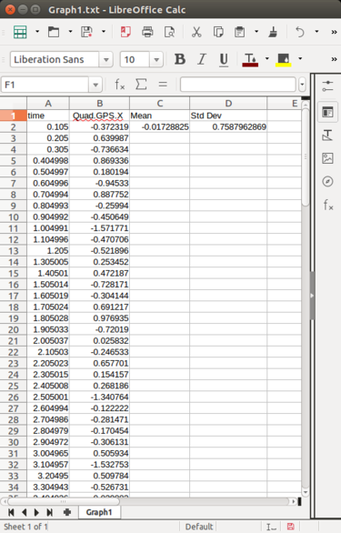 
<br /><br />
Following the instructions in the project README under Step 1: Sensor Noise, part 4:<br />
"Plug in your result into the top of config/06\_Sensornoise.txt. Specially, set the values for MeasuredStdDev\_GPSPosXY and MeasuredStdDev\_AccelXY to be the values you have calculated."

When I plugged in the values shown in screen captures, the IMU data was at 68% and passed the test, <span style="color:red">but the GPS data was at about 75% and didn't pass</span>. I speculated that needed more GPS samples, so I ran scenario\_6 for 100 seconds instead of 10 seconds and re-calculated the standard deviation for the GPS.

This time I got:<br />
<span style="color:red">```Std Dev = 0.6908```</span><br />

Plugging this new value back into the 06_Sensornose.txt file allowed the test to pass:<br /><br />
```(fcnd) [1214] jaguar: CPPEstSim ```<br />
```SIMULATOR!```<br />
```Select main window to interact with keyboard/mouse:```<br />
```LEFT DRAG / X+LEFT DRAG / Z+LEFT DRAG = rotate, pan, zoom camera```<br />
```W/S/UP/LEFT/DOWN/RIGHT - apply force```<br />
```C - clear all graphs```<br />
```R - reset simulation```<br />
```Space - pause simulation```<br />
```Simulation #1 (../config/06_SensorNoise.txt)```<br />
```Simulation #2 (../config/06_SensorNoise.txt)```<br />
```PASS: ABS(Quad.GPS.X-Quad.Pos.X) was less than MeasuredStdDev_GPSPosXY for 68% of the time```<br />
```PASS: ABS(Quad.IMU.AX-0.000000) was less than MeasuredStdDev_AccelXY for 68% of the time```<br />
```Simulation #3 (../config/06_SensorNoise.txt)```<br />
```PASS: ABS(Quad.GPS.X-Quad.Pos.X) was less than MeasuredStdDev_GPSPosXY for 68% of the time```<br />
```PASS: ABS(Quad.IMU.AX-0.000000) was less than MeasuredStdDev_AccelXY for 68% of the time```<br />

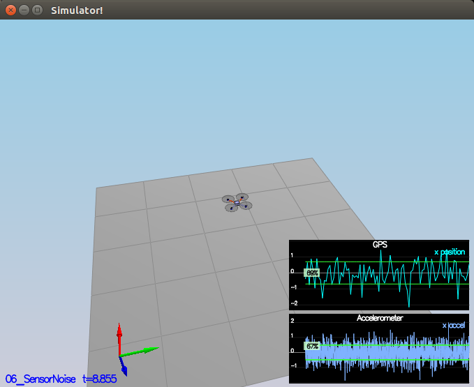
<br \><br \>
Note: Looking at the timestamps in the simulated IMU data, the sensor seems to be sampled every 0.005 sec (200 Hz), but when checking my answers against the simulaiton parameters in SimulatedSensors.txt, the IMU's dt is given as 0.002 (500 Hz). I'm not sure which to trust, and need to keep this in mind going forward.

### 2. Implement a Better Rate Gyro Scheme
<table border="1">
  <tr><th>CRITERIA</th><th>MEETS SPECIFICATIONS</th></tr>
  <tr>
	<td>Implement a better rate gyro attitude integration scheme in the UpdateFromIMU() function.</td>
	<td>The improved integration scheme should result in an attitude estimator of < 0.1 rad for each of the Euler angles for a duration of at least 3 seconds during the simulation. The integration scheme should use quaternions to improve performance over the current simple integration scheme.</td>
  </tr>
</table>
<br />
The goal is to improve the IMU/accelerometer complementary filter such that the filter makes more-accurate predictions.

The first thing I did was to study the code to ensure I understood it. As given to me, it was the same algorithm we had implemented in the python exercise. It was a linear function, because the values from the rate gyros were being used as-is to predict the next set of Euler angles, which is adequate if the pitch and roll angles are close to zero. But it can be made better by making the function non-linear, which in this case means to get the euler angles and body rates into the same reference frame before integrating the rates to produce new euler angle estimates.

The second half of the function involves fusing the IMU estimations with the accelerometer estimations. This is how a complimentary filter works. The accelerometer-based estimations will be noisy, but they don't suffer from drift. The IMU-based estimations will be more accurate, but involve integrations, so will accumulate errors and drift over time. I checked over this "given" part of the code to ensure that I thought it was correct. I rewrote some code here for clarity, but didn't change its functionality.

Hovever, I noticed that ```attitudeTau```, as configured in config/QuadEstimatorEKF.txt, was being set to 100, which -- based on my experience with the python exercise -- seemed much too high. So I changed it to 0.05 (about 25 times dtIMU). Other than that, I didn't change the "given" code.

I jumped right in and implemented something that defined a quaternion for the airframe attitude, and used it to rotate the body rates into the inertial frame before doing the integration, and this seemed to work -- sort-of -- but it wasn't good enough so I abandoned this approach.

The README suggested looking at the Udacity paper [Estimation for Quadrotors](https://www.overleaf.com/read/vymfngphcccj), section 7.1.2, "Nonlinear Complementary Filter", and I spent quite a lot of time studying this section, but there were too many truths left un-written, and I eventually gave up on this.

Eventually I took a look at the IntegrateBodyRate() function in the Quaternion class, and I instantly recognized equation (43) from the Udacity paper, and everything made sense and fell into place. I was on the right track in the beginning. I defined a quaternion for the attitude of the airframe relative to the inertial frame, and call its IntegrateBodyRate() function, passing in the un-rotated gyro data (in the body frame) and the dtIMU, and it will update the quaternion to reflect the next prediction. All that's left is to convert the new quaternion back to Euler angles, and those angles can be handed directly to the sensor fusion part of the code.

I quickly found out that the setting of ```attitudeTau = 0.05``` is no good for this filter, and found that the default value of 100 worked just fine.

And this test passes.

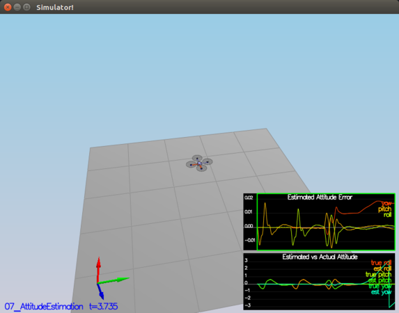

### 3. Implement Prediction Step
<table border="1">
  <tr><th>CRITERIA</th><th>MEETS SPECIFICATIONS</th></tr>
  <tr>
	<td>Implement all of the elements of the prediction step for the estimator.</td>
	<td>The prediction step should include the state update element (PredictState() function), a correct calculation of the Rgb [sic] prime matrix, and a proper update of the state covariance. The acceleration should be accounted for as a command in the calculation of gPrime. The covariance update should follow the classic EKF update equation.</td>
  </tr>
</table>

#### 3.1 Implement g()
I took a look at how the graphs were behaving before I made any changes. Upper graph had true\_y, est\_y, true\_vel\_y, est\_vel\_y. Both estimates were flat-lined at zero, and the actual values were updating normally. Similar for the other graph, but for z.

Next step is to implement QuadEstimatorEKF::PredictState(), which is what we've been calling the g() function. In the Udacity paper [Estimation for Quadrotors](https://www.overleaf.com/read/vymfngphcccj), it is equation (49) in section 7.2, "Transition Model".

Before constructing the parts of the matricies, I compared the given Rbg matrix (48) to its supposed source, Diebel, equation (67). It's supposed to be the inverse of this matrix. That makes sense, because (67) gives the rotation matrix that maps Euler angles (inerial) to the body frame, and we want to go the other way (body to inertial). And... it checks out. (48) is the inverse of (67). Now, since PredictState() already has a quaternion, attitude, for the body rotation in the inertial frame, Rbg is just attitude.RotationMatrix_IwrtB().

The control input, u\_t is described in the paper. See "Estimation for Quadrotors" equation (37), u\_t is our control input. It is a 4-element vector, xb\_dot\_dot, yb\_dot\_dot, zb\_dot\_dot, psi\_dot. The b\_dot\_dot vars are the accelerations in the body frame, given by parameter accel, and psi\_dot is the yaw rate in the inertial frame. However, in this code, the yaw is predicted in UpdateFromIMU(), so we don't update it here, and we don't need psi\_dot.

I decided to call the two matricies in the g() equation (49) "mga" (left-most) and "mgb" (right-most). As I implemented the code, however, I realized that I didn't need mgb. Most of it drops away. All I really need is attitude.RotationMatrix_IwrtB(), which gets multiplied by the accel param * dt, and this is added to the three velocity components of mga.

Once I had implemented this function, I re-ran scenario 8, and I got results similar to those shown in the project README.

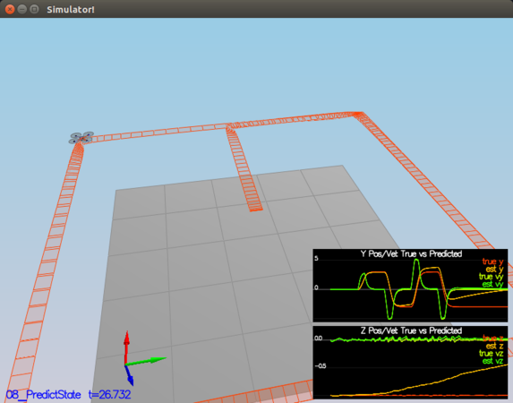

#### 3.2 Add noise and implement Rbg'

Ran scenario 9, and saw that the predicted X position and predicted X velocity were diverging from zero, even though the quad copters were all hovering and not changing X position.

To calculate Rbg', reference the Udacity paper, equation (52), which the authors claim is the partial derivative of the Rbg matrix with respect to psi. I verified this with sympy. Then it was just a matter of carefully and painfully laying out the matrix in GetRbgPrime().

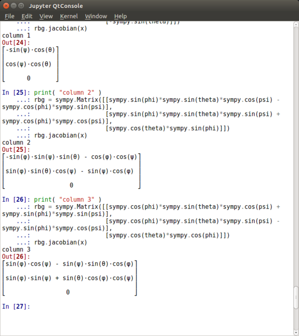

#### 3.3 Implement Predict()

Here's what I need to implement:

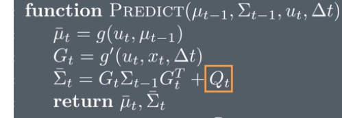

u\_bar\_t is already supplied by:<br />
```VectorXf newState = PredictState(ekfState, dt, accel, gyro);```<br />
... which is assigned to ekfState at the bottom of the function. So that's done already.

I need to build G\_t (aka gPrime) from RbgPrime. This is given in the Udacity document as equation (51). A good deal of this is constructed for me already because gPrime has already been set to the identity matrix. I need to fill in a few delta\_ts. The only tricky part are the terms that use RbgPrime. Each of these takes a row from RbgPrime, takes the dot product with u\_t, resulting in a scaler, then multiplies by delta\_t.

Sigma\_t-1 is the current ekfCov, which I will update. Q_t is class variable Q, which has already been constructed from config files.

The rest is just implementing the equation that calculates the new Sigma\_t, which is assigned to ekfCov.

#### 3.4 Tune QPosXYStd and QVelXYStd

This was a matter of running scenario 09_PredictionCov, and experimenting to get graphs similar to what was shown in the README.

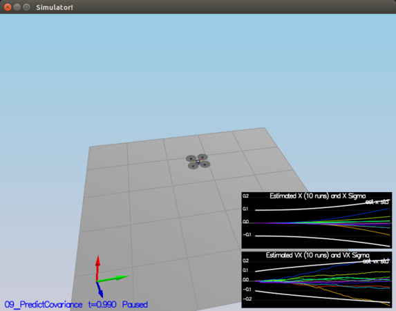

### 4. Implement Magetometer Update
<table border="1">
  <tr><th>CRITERIA</th><th>MEETS SPECIFICATIONS</th></tr>
  <tr>
	<td>Implement the magnetometer update.</td>
	<td>The update should properly include the magnetometer data into the state. Note that the solution should make sure to correctly measure the angle error between the current state and the magnetometer value (error should be the short way around, not the long way).</td>
  </tr>
</table>

#### 4.1 Tune QYawStd

Following the README, I ran scenario 10\_MagUpdate and noted that the estimated Yaw error was climbing out of the standard deviation boundaries (white line). I increased QYawStd from 0.05 to 0.08, and the graph now looks similar to what is shown in the README.

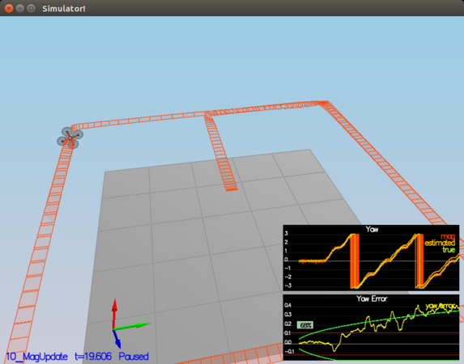

#### 4.2 Implement Magnetometer update function UpdateFromMag()

Refer to Udacity paper section 7.3.2. It says we read yaw directly from the sensor, and it's in the global frame. That's not what Angela said in the section on sensors -- she said the magnetometer would measure the North vector in the body frame. But if we're measuring yaw directly, I don't need roll and pitch here. I just need to implement the update function:


But this has already been implemented in function Update(), so it's just a matter of passing in the correct matricies. The only tricky part to this function is normalizing the estimated state. When yaw is near -/+ PI, there is a discontinuity, and the estimated state may be, for example PI+0.1, and the measured value may be, for example, -PI-0.1. These two values are fairly close to each other, but mathematically, they are almost 2PI radians apart, which looks like an estimation error. One way to fix this is to test if the values have differing signs. If so, and the values are near PI or -PI, add or subtract 2PI to/from the estimation.

After implementing this function, I got good results, passed the tests, and did not have to re-tune QYawStd.

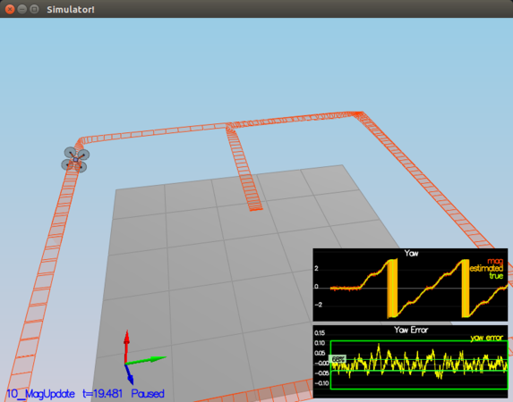

### 5. Implement GPS Update
<table border="1">
  <tr><th>CRITERIA</th><th>MEETS SPECIFICATIONS</th></tr>
  <tr>
	<td>Implement the GPS update.</td>
	<td>The estimator should correctly incorporate the GPS information to update the current state estimate.</td>
  </tr>
</table>

Now we're on to scenario 11\_GPSUpdate. This is about following the README and experimenting with various changes, moving from ideal estimator + ideal IMU to my estimator + ideal IMU, to my estimator + realistic IMU, etc. Until finally implementing the GPS Update function using the matricies defined in Udacity paper section 7.3.1, and tuning the result.

#### 5.1 Ideal estimator and ideal IMU
When I ran 11\_GPSUpdate with an ideal estimator and ideal IMU, the quad copter makes a nice square at a consistent altitude. On the bottom graph, they've added new values quad.est.e.pos is the estimated position error. quad.est.s.z is the estimated standard deviation of Z (altitude). As time goes on, quad.est.e.pos drifts a lot and true y vs est y gets worse and worse.

#### 5.2 My estimator
Now I switch to use my estimator instead of an ideal estimator. The quad plane flies fairly well for a while until the accumulated errors throw the estimations off.

#### 5.3 Realistic IMU
Next, we introduce a realistic IMU with noise. Now flight becomes terribly off course, but I can read the standard deviations from the bottom graph and tune to the noise.

#### 5.4 Tune the process noise model
quad.est.s.z seems to trend toward 2, so I made QPosZStd = 2. quad.est.s.y seems to trend toward 0.8, so I made QPosXYStd = 0.8, and continued this process for QVelXYStd, QVelZStd, QYawStd. I settled on these values:

```QPosXYStd = .8```<br />
```QPosZStd  = 2```<br />
```QVelXYStd = .2```<br />
```QVelZStd  = .4```<br />
```QYawStd   = .03```<br />

#### 5.5 Implement the EKF GPS Update function
This is in UpdateFromGPS(), and it's the same idea as updating the magnetometer. This time, we use section 7.3.1 in the Udacity paper.

#### 5.6 Complete the entire simulation cycle
This is a matter or repeating the Std tuning until the test passes. The values I settled on are:

```QPosXYStd   = .3```<br />
```QPosZStd    = .8```<br />
```QVelXYStd   = .05```<br />
```QVelZStd    = .13```<br />
```QYawStd     = .01```<br />
```GPSPosXYStd = .7```<br />
```GPSPosZStd  = 2```<br />
```GPSVelXYStd = .1```<br />
```GPSVelZStd  = .3```<br />

The simulation doesn't look very good, but the measured positions and velocities track the estimated versions, and the test passes.

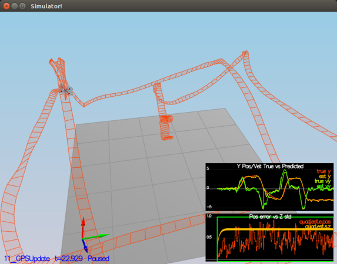

```(fcnd) [1342] jaguar: CPPEstSim ```<br />
```SIMULATOR!```<br />
```Select main window to interact with keyboard/mouse:```<br />
```LEFT DRAG / X+LEFT DRAG / Z+LEFT DRAG = rotate, pan, zoom camera```<br />
```W/S/UP/LEFT/DOWN/RIGHT - apply force```<br />
```C - clear all graphs```<br />
```R - reset simulation```<br />
```Space - pause simulation```<br />
```Simulation #1 (../config/11_GPSUpdate.txt)```<br />
```Simulation #2 (../config/11_GPSUpdate.txt)```<br />
```PASS: ABS(Quad.Est.E.Pos) was less than 1.000000 for at least 20.000000 seconds```<br />
```Simulation #3 (../config/11_GPSUpdate.txt)```<br />
```PASS: ABS(Quad.Est.E.Pos) was less than 1.000000 for at least 20.000000 seconds```<br />

Looking at the z position data, I think the main reason that the simulation looks so bad in real time is that the altitude updates from the GPS are so bad and coming in so slowly. To test this, I edited SimulatedSensors.txt and changed the Std Dev of the GPS altitude measurement from 2 to 0.2. I got a much better outcome.

## Flight Evaluation

### 6. Meet Performance Goals
<table border="1">
  <tr><th>CRITERIA</th><th>MEETS SPECIFICATIONS</th></tr>
  <tr>
	<td>Meet the performance criteria of each step.</td>
	<td>For each step of the project, the final estimator should be able to successfully meet the performance criteria with the controller provided. The estimator's parameters should be properly adjusted to satisfy each of the performance criteria elements.</td>
  </tr>
</table>

When I went back with the "final" estimator tunings and re-ran each scenario, I found that the magnetometer test would no longer pass, and I had to reset the QyawStd variable to its former value.

```QYawStd     = .08```<br />

Also, I looked at the output of scenario 09, and noticed that these graphs were telling me that my "final" QPosXYStd was set too high, and the QVelXYStd was set too low. I readjusted them as below, and now all the tests pass.

```QPosXYStd = .1```<br />
```QVelXYStd = .2```<br />

### 7. Fly Successfully
<table border="1">
  <tr><th>CRITERIA</th><th>MEETS SPECIFICATIONS</th></tr>
  <tr>
	<td>De-tune your controller to successfully fly the final desired box trajectory with your estimator and realistic sensors.</td>
	<td>The controller developed in the previous project should be de-tuned to successfully meet the performance criteria of the final scenario (<1m error for entire box flight).</td>
  </tr>
</table>

I copied my version of QuadControl.cpp and the associated tuning file into the estimator project, re-ran scenario 11, and as suggested by the README, my vehicle crashed prtetty quickly. So the controller needs to be detuned. The README suggests that I decrease the position and velocity gains by about 30%.

But I couldn't get it to work at all. Eventually, I put all of these back like they used to be:

```Quad.UseIdealEstimator = 1```<br />
```SimIMU.AccelStd = 0,0,0```<br />
```SimIMU.GyroStd = 0,0,0```<br />

And it _still_ didn't work. It worked with all of the old scenarios from the conrtoller project, but not with scenario_11. This forced me to revisit my earlier controller submission. I found errors in:

```RollPitchControl()```<br />
```AltitudeControl()```<br />
```LateralPositionControl()```<br />

After correcting those errors, it was easy to de-tune the controller and get it to work with the estimator.

```(fcnd) [1418] jaguar: CPPEstSim```<br />
```SIMULATOR!```<br />
```Select main window to interact with keyboard/mouse:```<br />
```LEFT DRAG / X+LEFT DRAG / Z+LEFT DRAG = rotate, pan, zoom camera```<br />
```W/S/UP/LEFT/DOWN/RIGHT - apply force```<br />
```C - clear all graphs```<br />
```R - reset simulation```<br />
```Space - pause simulation```<br />
```Simulation #1 (../config/11_GPSUpdate.txt)```<br />
```Simulation #2 (../config/11_GPSUpdate.txt)```<br />
```PASS: ABS(Quad.Est.E.Pos) was less than 1.000000 for at least 20.000000 seconds```<br />
```^C```<br />

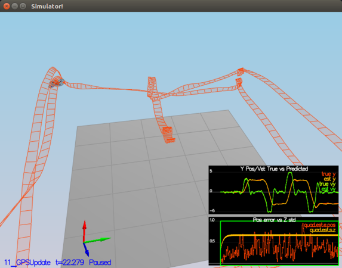

