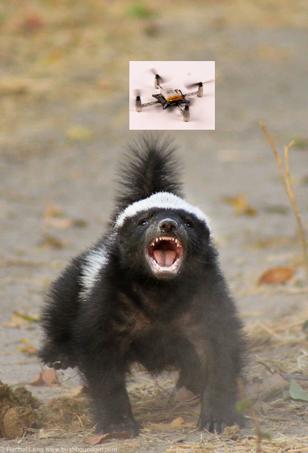
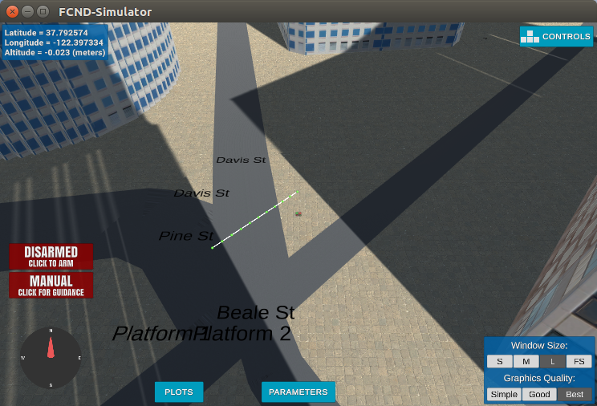

# Project: 3D Motion Planning
### Vic Sperry, Udacity Flying Car Nanodegree, 30 Sep 2018



## [Rubric](https://review.udacity.com/#!/rubrics/1534/view) Points
### 1. Writeup / README
This is the writeup. I wish I knew how to use gimp better so I could merge the Crazyflie and the crazed badger pics better.

### 2. Explain the Starter Code
The initial version of motion\_planning.py is an enhanced version of backyard\_flyer.py. Both define a subclass of class Drone, which provides a way to connect to the FCND simulator using MAVLink on TCP/loopback and hook into important callbacks for vehicle position, vehicle velocity, etc. So both can control a simulated quadrotor.

motion\_planning.py comes with Udacity implementations of the functions that had to be developed in the backyard\_flyer project, for example, local\_position\_callback(), velocity\_callback(), etc, so motion\_planning.py flies the quadrotor out of the box.

Since motion\_planning.py is intended to teach path planning, it has one major piece that backyard\_flyer.py lacks -- a new mode, PLANNING, and a new method, plan\_path().

As provided to the student, plan\_path() reads in the familiar colliders.csv that we've been working with in the exercises. This file provides a list of obstacles that roughly correspond to a 0.2 square mile area in San Francisco near the Embarcadero ferry building. It uses create\_grid() in planning\_utils.py to convert the obstacle list into a 2.5D grid, places the quadrotor in the center of the grid, and picks an arbitrary goal sqrt(200) grid spaces away (10 grid spaces to the East and 10 grid spaces to the North).

plan\_path() then uses a\_star() from planning\_utils.py to find a path from start to goal. We're lucky that there are no buildings here, because there's no checking for obstacles. In this case, a\_star() repeatedly uses valid\_actions() to pick a North, South, East, or West direction to move one grid square. Since the start position and goal are on a diagonal, but valid\_actions() only allows N,S,E,W, we end up with a zig-zag path to the goal. It works, but we got lucky that we didn't fly into a building.

And, you can make a\_star() pick a straight line to the goal by merely adding in diagonal directions in class Action(Enum), and the corresponding moves in valid\_actions(). There are too many waypoints, however. Once the straight-line is produced, it'd be better to remove all but the start and goal. Anyway, here's a picture of the diagonal.



### 3. Implementing Your Path Planning Algorithm
#### A. Set your global home position
I spent a little time trying to find a nifty function in numpy that would read and parse the first line of colliders.csv for me, but I couldn't find it, so I just used open() and readline(), then split the strings around spaces and the one irritating comma. I didn't want to suck in the whole file. Once you've isolated lat and lon, set\_home_position() is trivial. You just need to take care to pass the arguments correctly. If you swap them, nothing would work. I tried it for fun, and I was surprised that I didn't get an error since a latitude of -122 degrees is out of range +/- 90. Instead, the numbers were accepted, and the quadrotor took off on a path perpendicular to the expected path.

#### B. Set your current local position
It looks to me as if there is no way to _set_ my current local position. It appears to be controlled by the simulator, and I don't see a way to adjust this in the simulator, either via a command line option or in the "parameters" menu. In real life, the drone would figure out its position via GPS (assuming it had one).

But, as instructed, I used global\_to\_local() from frame\_utils.py to convert global\_position, global\_home to a local copy of local\_position. Here's the code and the output of the print statements. In each direction, the quadrotor is within 0.1 m of the origin of the NED frame.

<pre>
local_position = global_to_local(self.global_position, self.global_home)
self.print_global_position()
self.print_local_position()
print("local local_position, m NED=[",
      local_position[0], ",",
      local_position[1], ",",
      local_position[2], "]")```
</pre>

<pre>
Searching for a path ...
global position=[lon= -122.3974505 , lat= 37.7924792 , alt= 0.085 ]
local_position, m NED=[ -0.08623935282230377 , -0.03731628879904747 , -0.08329690247774124 ]
local local_position, m NED=[ -0.0890434761531651 , -0.043450654367916286 , -0.085 ]
global home [-122.39745   37.79248    0.     ], position [-1.22397451e+02  3.77924792e+01  8.50000000e-02], local position [-0.08623935 -0.03731629 -0.0832969 ]
North offset = -316, east offset = -445
Local Start and Goal:  (316, 445) (326, 455)
Found a path.
</pre>

#### C. Set grid start position from local position
There is a comment in the starter code that says "Define starting point on the grid (this is just grid center)". That threw me off. grid.shape = 921,921, so to me "grid center" is cell 460,460. It took me much too long to figure out that what was really meant was "this is just the point in collides.py where Posx, Posy are 0,0". This point is at grid cell (316, 445), which is the intersection of Pine St, Market St, Beale St, and Davis St.

My approach was to save north\_offset and east\_offset in the class, and use them to convert a local position to a grid cell.

See local\_position\_to\_grid\_cell().

#### D. Set grid goal position from geodetic coords
I had two problems here. First, I picked a location to fly to using Google maps. The spot I picked was on Battery St in fromt of The Punchline. When I converted this to a grid cell, I found I was in some building. So I flew the quadrotor manually in the simulator until I found the same spot, and noticed that the latitude/longitude was different than what Google maps reports. That seems like some kind of scaling bug in how the simulator and the colliders.csv file map the city. However, putting that lat/lon into my code found an empty space in the grid, so I moved forward with that.

My second problem with this Punchline lat/lon was that it took a_star() too long to find a path to it. Even though it worked, by the time it produced the path (5-6 min later), the simulator was apparently in an odd state, because there was a message queued up that didn't have a timestamp, and drone.py did this:

<pre>
Local Start and Goal:  (316, 445) (730, 117)
Found a path.
Sending waypoints to simulator ...
Traceback (most recent call last):
  File "/home/vsperry/tools/anaconda3/envs/fcnd/lib/python3.6/site-packages/udacidrone/connection/connection.py", line 88, in notify_message_listeners
    fn(name, msg)
  File "/home/vsperry/tools/anaconda3/envs/fcnd/lib/python3.6/site-packages/udacidrone/drone.py", line 117, in on_message_receive
    if (((msg.time - self._message_time) > 0.0)):
AttributeError: 'int' object has no attribute 'time'
</pre>

Just to see it work, I ran a\_star() again and dumped out the waypoints, hard-coded them, bypassed a\_star(), and watched it go.

These waypoints are saved in waypoints\_to\_punchline.txt. It worked! Here's a picture of the end part of this flight. The waypoints had not been culled at the time this way captured.


After this, I restored the a\_star() algorithm and picked a closer position to which to navigate. I used the intersection of Battery and Pine.

#### E. Modify A* to include diagonal motion (or replace A* altogether)
This was actually the first thing I modified because I knew I would need it. See section 2 above.

#### F. Cull waypoints 
Here I borrowed the code from our exercise "Putting it together", and used a collinearity check to cull the path. I chose to cull the path rather than the waypoints because that's what the TODO said to do.

The path pruning code is implemented in methods:

* point() - this extends a position (X, Y) to (X, Y, 1). In order to do a collinearity check using the determinant of a matrix, the matrix has to be 3X3. So we'll extend each grid position to a [1X3] array with the Z-component being unity, which makes it a no-op.

* collinearity\_check() - arranges the three [1x3] points as a 3X3 matrix and takes the determinant. If the determinant is zero (or close enough), the three points are collinear.

* prune\_path() - This is a generalized version of the prune_path algorithm used in the "Putting it together" exercise. In the original code, the points considered were always next to each other and the middle point would be removed if the three points were collinear. In this update, I've added a parameter, dp (delta\_point) that can be used to jump over points. For example:
  * dp=1 => test path[i], path[i+1], path[i+2] for collinearity
  * dp=2 => test path[i], path[i+2], path[i+4] for collinearity
  * dp=3 => test path[i], path[i+3], path[i+6] for collinearity

The reason I chose to extend prune\_path() is because I wasn't satisfied with how few path points were removed by the default algorithm. a\_star() found 261 points and the default prune\_path() only brought it down to 50 points, with several section being zig-zag much like the original path supplied by the starter implementation. Considering three points next to each other doesn't remove the zig zag sections.

But it was easy to see that if I tried points that were apart by i, i+2, i+4 I might have better results on the zig-zag sections, so I tried it and things got better.

But not good enough, so I decided to try every possible jump starting by testing the endpoints (grid\_start, grid\_goal) and the point halfway between them. Then making the next jump one less, and so on until I ended up testing three contiguous points. This is handled by this code in plan\_path(): 
<pre>
        pruned_path = path
        for dp in range(int(len(pruned_path)/2),0,-1):
            pruned_path = self.prune_path(pruned_path, dp)
</pre>

I was very happy with the results! The number of path points went from 261 down to 4!

### 4. Execute the flight
It works! I love the small list of waypoints.
